---

title: "Diseño e Implementación de Infraestructura de red segura en EcoSea Systems S.A."
date: 2026-05-03
draft: false
tags: ["Redes", "Arquitectura", "pfSense", "DMZ", "OpenVPN", "Suricata", "Wireshark"]
description: "Mejora de seguridad en una red empresarial altamente vulnerable"

---
&ensp;

---
&ensp;

## **`Este proyecto de infraestructura segura fue desarrollado como caso de estudio de finalización de grado, simulando un entorno empresarial real con vulnerabilidades críticas e infraestructura Expuesta`**

&ensp;

**Parte 1:**

> 📖 _En este post:_
> 
> 1. Reconstrucción del ataque
>     
> 2. Diseño de red segmentada
>     
> 3. VLANs y troncales
>     
> 4. STP y root bridge
>     
> 5. Seguridad de puertos


&ensp;
## 🏢 Perfil Corporativo: EcoSea Systems S.A.

**EcoSea Systems** es una empresa líder en la región dedicada al procesamiento, empaque y distribución de productos del mar de alta exportación. Con una planta de operaciones que funciona 24/7, la continuidad de sus servicios digitales es el motor de su cadena de suministro.

### 📋 Ficha Técnica de la Organización

- **`Sector:`** Procesamiento Industrial y Logística Marítima.
    
- **`Tamaño:`** Pequeña-Mediana Empresa (PYME) con una dotación de **30 puestos de trabajo** administrativos y operativos.

&ensp;

### ⚠️ El Escenario de Crisis (Estado Inicial)

Antes de la intervención técnica, EcoSea Systems operaba bajo un modelo de "confianza implícita", lo que resultó en una **superficie de ataque crítica**:

**`1. Red Plana y Silenciosa:`** Toda la infraestructura compartía un único switch central, con una red sin segmentación y servidor web expuesto al Internet permitiendo el paso a una infección por malware en toda la red alcanzando al servidor de base de datos sensibles.

**`2. Exposición de Servicios:`** Servicios críticos como **SSH y RDP** estaban expuestos directamente a Internet sin capas de protección adicionales.

**`3. Brechas de Seguridad Detectadas:`**

- Múltiples intentos de fuerza bruta en los servicios de acceso remoto.
- Presencia de servicios obsoletos y vulnerables como `vsftpd 2.3.4` (backdoor conocido).

&ensp;

### 🎯 Objetivos del Proyecto 

La gerencia de EcoSea Systems solicitó una reestructuración total bajo tres pilares fundamentales:

* **`Seguridad por Diseño:`** Aislar los departamentos y servicios públicos (DMZ) para contener posibles amenazas mediante creación de VLAN's y reglas de firewall.

* **`Alta Disponibilidad (Redundancia):`** Implementar una solución de **doble ISP con Failover** para asegurar que la planta nunca pierda conexión con sus clientes globales.

* **`Vigilancia Activa (IDS/VPN):`** Desplegar herramientas de detección de intrusos y túneles cifrados para el acceso administrativo seguro.

&ensp;

---

&ensp;

## 🔍 Fase 1: Diagnóstico y Análisis Forense (El Incidente)


Antes de proponer una nueva arquitectura, realicé una auditoría profunda sobre la infraestructura existente de **EcoSea Systems**. El análisis de los artefactos (Logs de Apache y capturas de tráfico PCAP) reveló una exposición crítica y una serie de intrusiones en curso.

> _**Nota:** Los archivos .pcap y logs de Apache mostrados aquí son una **reconstrucción basada en el caso de estudio**. La IP atacante está dentro de la misma red (192.168.20.0/24) para simular un ataque desde un equipo interno comprometido o un movimiento lateral. ¿Por qué hice esto? Porque la institución académica no proporcionó capturas reales, y decidí tomar la iniciativa de construir un escenario forense completo y reproducible._

&ensp;

## 🔍 Reconstruyendo el ataque a EcoSea Systems S.A.: así se movió el atacante

&ensp;

### 🚩 Paso 1: El primer contacto — Escaneo de reconocimiento

Todo ataque comienza con una mirada curiosa. El atacante quiere saber: **¿qué puertos están abiertos?**

Usando Wireshark, filtré por `tcp.flags.syn == 1 && tcp.flags.ack == 0` (un tipo de escaneo en el cual no se cierra la conexión). El resultado es evidente:


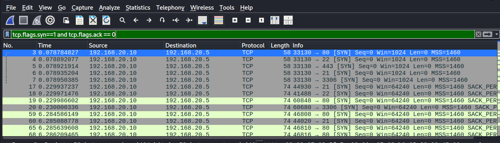


> Desde `192.168.20.10` (IP atacante simulada) se lanzaron ráfagas SYN contra múltiples puertos del servidor `192.168.20.5`: **21, 22, 80, 443, 3306**.

Eso es un **TCP SYN scan** (half-open). El atacante estaba mapeando el terreno sin completar conexiones, justo como haría con una herramienta como Nmap.

&ensp;

### 🚩 Paso 2: Subida de archivo malicioso — La puerta trasera

La empresa reportó accesos extraños al servidor web. Revisé los logs de Apache con un simple `grep "192.168.20.10" access.log` y encontré esto:

- Un `POST` al endpoint `/upload`
    
- Múltiples `GET` desde la misma IP después de la subida
    

**Patrón clásico:** el atacante subió un archivo (probablemente una **reverse shell en PHP**) y luego lo ejecutó para ganar acceso remoto.

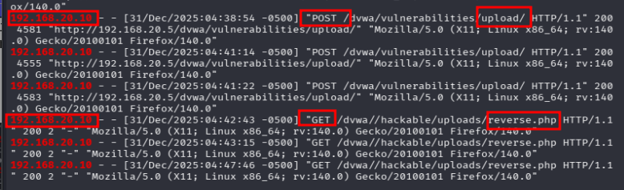

&ensp;

Para confirmarlo, volví al `.pcap` y vi el tráfico de la subida con múltiples solicitudes al endpoint vulnerable.

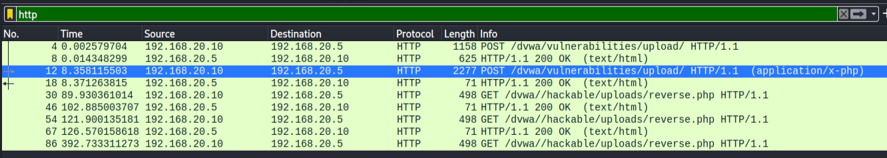

&ensp;

### 🚩 Paso 3: Fuerza bruta a SSH — Insistencia hasta lograrlo

Otra anomalía: múltiples intentos de conexión al puerto 22 en muy poco tiempo. Filtré por protocolo SSH en Wireshark y el panorama fue claro:

> 🔐 Decenas de intentos de login en segundos. Usuarios y contraseñas siendo rechazados uno tras otro.

Crucé esta información con los logs del sistema (`auth.log`) quedando al descubierto un **ataque de fuerza bruta**. Herramientas como Hydra o Medusa, diccionarios de por medio, probando combinaciones hasta dar con la correcta.

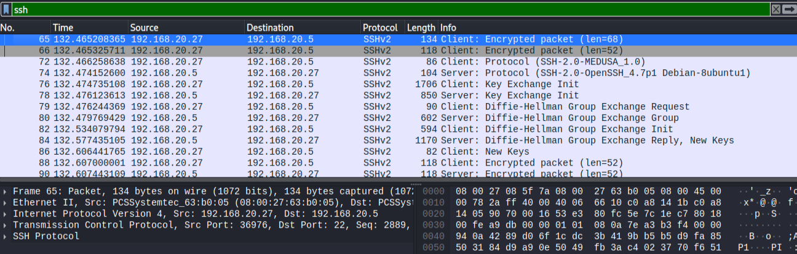
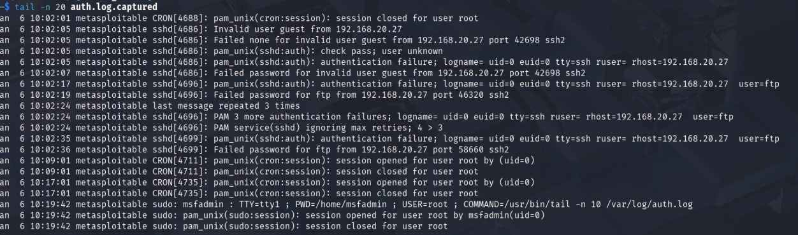

&ensp;
&ensp;

### 🚩 Paso 4: Escaneo de vulnerabilidades — Lo que Nmap descubrió

Una vez identificados los puertos abiertos, usé **Nmap** con scripts de detección (`-sCV`) para conocer versiones exactas de los servicios:

```bash
nmap -sCV -n -p21,22,80,3306 192.168.20.5 -oN Puertos_Servidor
```

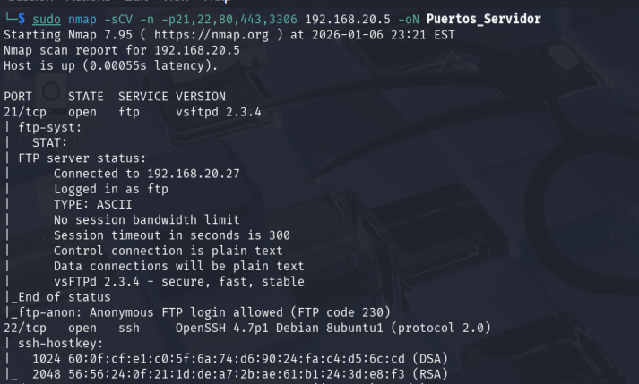
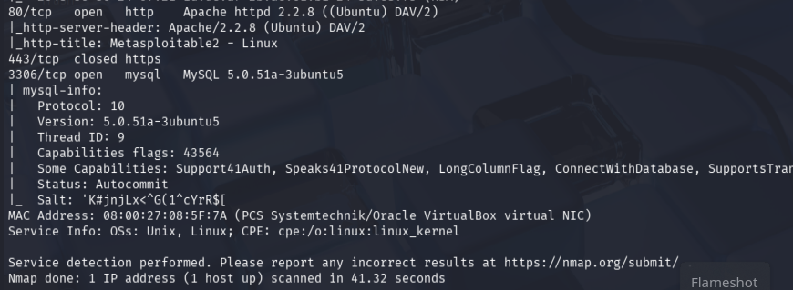

&ensp;

Luego, con **searchsploit** busqué vulnerabilidades públicas para cada versión. El resultado mostró un **alto nivel de compromiso**:

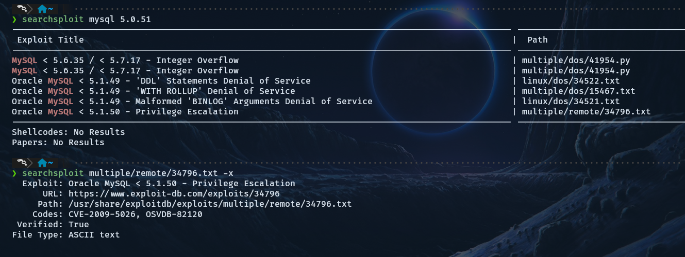

&ensp;


| Puerto | Servicio | Versión               | ¿Qué encontré?                                         |
| ------ | -------- | --------------------- | ------------------------------------------------------ |
| 21     | FTP      | vsftpd 2.3.4          | 🔴 Backdoor intencional → ejecución remota de comandos |
| 22     | SSH      | OpenSSH 4.7p1         | 🟡 Versión 2007, claves DSA débiles, fuerza bruta      |
| 80     | HTTP     | Apache 2.2.8 + WebDAV | 🔴 WebDAV permite PUT/DELETE → subida de webshell      |
| 3306   | MySQL    | 5.0.51a               | 🔴 Múltiples CVEs, acceso remoto posible               |


&ensp;

## Conclusión

El análisis forense confirmó algo grave: **el atacante no necesitó ser un experto**. La infrastructura estaba regalada:

- ❌ Servidores obsoletos (vsftpd con backdoor, Apache 2008, MySQL 2007)
    
- ❌ Puertos críticos abiertos a Internet sin restricción
    
- ❌ Red plana → una vez dentro del servidor web, el atacante ve TODA la red interna
    
- ❌ Sin HTTPS, sin firewall, sin IDS
    

**La topología plana fue el error fatal.** Comprometer un solo equipo significa comprometerlo todo.

&ensp;

---

&ensp;

&ensp;

## 🌐 Fase 2: Arquitectura de Red: Diseño e implementación

 

Antes de profundizar en la implementación física, se diseñó una infraestructura lógica centrada en la resiliencia y el aislamiento de amenazas para **EcoSea Systems**.

### Especificaciones de la Topología

- **`Modelo de Red:`** Diseño de estrella jerárquica utilizando una configuración de **Router-on-a-Stick** para una gestión eficiente del tráfico inter-VLAN.

* **`Continuidad de Negocio (HA):`** Implementación de **Doble WAN (ISP Redundante)** mediante pfSense, configurando un sistema de _Failover_ que garantiza la visibilidad del servidor web incluso ante la caída de un proveedor.

* **`Estructura Conmutada:`** Jerarquía de un **Switch Core** conectado a tres switches de acceso, optimizando el ancho de banda y la seguridad a nivel de puerto.

&ensp;

### 🔒 Segmentación Lógica (VLANs)

La red se dividió en tres segmentos críticos para aplicar el principio de mínimo privilegio:

* **`VLAN 10 (LAN Interna):`** Tráfico de usuarios y estaciones de trabajo

* **`VLAN 20 (DMZ):`** Zona aislada para el servidor web expuesto, evitando cualquier contacto directo con la red interna.

* **`VLAN 30 (Administrativa):`** Segmento restringido para tareas de gestión y configuración de dispositivos.

&ensp;

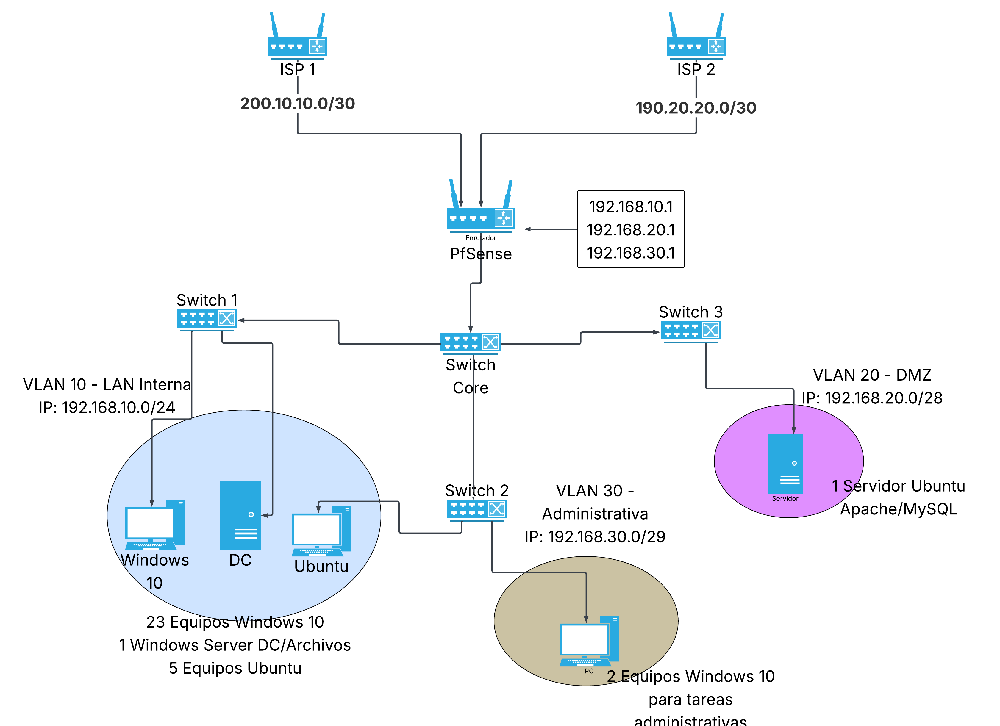

A continuación, se detallan los componentes clave visualizados en el diagrama:

### Perímetro y Alta Disponibilidad

- **`ISP Redundancy:`** La red cuenta con dos proveedores de servicios (ISP 1 e ISP 2) configurados en el **pfSense**. Esto asegura que los servicios de la empresa permanezcan en línea mediante un mecanismo de failover automático si uno de los enlaces falla.

* **`Gateway Centralizado:`** El pfSense actúa como el cerebro de la red, gestionando no solo el enrutamiento, sino también el firewall perimetral y el sistema de detección de intrusiones (IDS).

### Infraestructura de Switching

- **`Core-to-Access:`** Se implementó una estructura jerárquica con un **Switch Core** central que distribuye el tráfico hacia tres switches de acceso. Este diseño facilita la escalabilidad y mejora la gestión del ancho de banda interno.

* **`Segmentación por VLANs:`** Mediante el protocolo **802.1Q**, la red se ha dividido lógicamente para reducir el dominio de difusión y aplicar políticas de seguridad.

### Control de Acceso y Seguridad de Capa 3

* **`Aislamiento de la DMZ:`** La VLAN 20 está configurada para que el servidor web no tenga visibilidad ni acceso hacia la LAN Interna (VLAN 10), mitigando el riesgo de movimiento lateral en caso de una intrusión.

&ensp;


---

&ensp;
&ensp;

## 🧱 Configuración de la red en Packet Tracer

Antes de implementar el firewall, construí la base de la red segmentada:

&ensp;

### 1️⃣ **Topología propuesta**

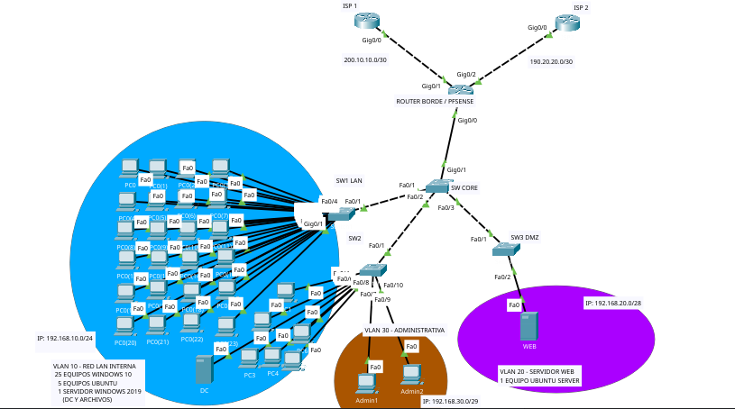

&ensp;
&ensp;

&ensp;

### 2️⃣ **Router borde: Subinterfaces y enrutamiento inter-VLAN (Router on a stick)**


&ensp;

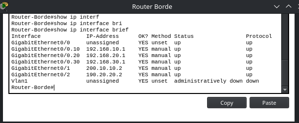

Se configuraron subinterfaces en el router borde para actuar como gateway de cada VLAN:

- `G0/0.10` → VLAN 10 (LAN interna) con IP `192.168.10.1`
    
- `G0/0.20` → VLAN 20 (DMZ) con IP `192.168.20.1`
    
- `G0/0.30` → VLAN 30 (Administrativa) con IP `192.168.30.1`

&ensp;

> _📌 Nota: En la implementación real, este enrutamiento será realizado por **pfSense**. Sin embargo, dado que Packet Tracer no soporta pfSense, se utilizó un router Cisco para **validar la conectividad de la capa de conmutación** (VLANs, trunks, etc.) antes de incorporar el firewall. Una vez validada la base, pfSense asumirá el control añadiendo reglas de firewall, IDS y VPN._

&ensp;

### 3️⃣ **Switch Core: Troncales (trunks) con VLANs permitidas**

&ensp;

### **3.1 Creación de VLANs**

Primero, se crearon las VLANs necesarias para segmentar la red:

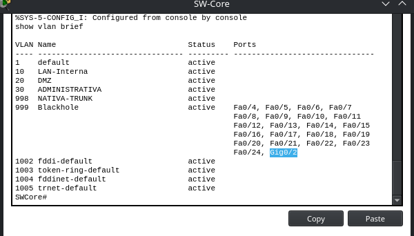

&ensp;

### **3.2. Configuración del trunk principal**

El trunk hacia el router/pfSense se configuró permitiendo **exclusivamente** las VLANs 10, 20 y 30, y se cambió la VLAN nativa a la 998 por seguridad:

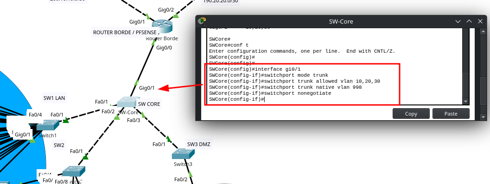

&ensp;

> ⚠️ **Nota de seguridad:** Al limitar las VLANs permitidas en el trunk, incluso si un atacante compromete el switch, no puede inyectar tráfico de VLANs no autorizadas.


&ensp;

### 4️⃣ **Seguridad en puertos de acceso (switch de acceso LAN)**

Configuración de seguridad en switch de acceso (SW1 - VLAN 10)

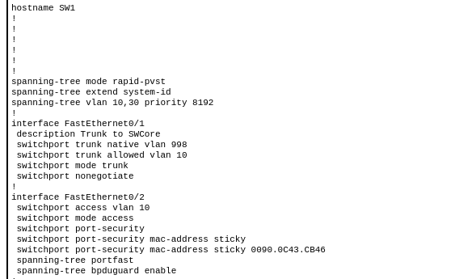

Se aplicaron múltiples medidas de hardening en los switches de acceso:

- **En el trunk** (`Fa0/1`): VLAN nativa cambiada a 998, solo se permite la VLAN 10, y se deshabilita la negociación DTP.
    
- **En el puerto de acceso** (`Fa0/2`): Port-security con MAC sticky, PortFast y BPDU Guard para evitar switches no autorizados.
    
- **A nivel global**: STP Rapid-PVST con prioridad ajustada para evitar que un switch rogue se convierta en root bridge.


| Switch          | Función        | STP Priority    | Medidas específicas                                                    |
| --------------- | -------------- | --------------- | ---------------------------------------------------------------------- |
| **SW-Core**     | Root bridge    | 4096 (más baja) | Trunks con `allowed vlan`, native 998, BPDU Guard en puertos de acceso |
| **SW1 (LAN)**   | Acceso VLAN 10 | 8192            | Trunk restringido solo a VLAN 10, port-security, portfast, bpduguard   |
| **SW2 (ADMIN)** | Acceso VLAN 30 | 8192            | Trunk restringido a VLAN 10 y 30, mismas medidas de puerto             |
| **SW3 (DMZ)**   | Acceso VLAN 20 | 8192            | Trunk restringido solo a VLAN 20, **sin acceso a LAN interna**         |


&ensp;
&ensp;

### 5️⃣ **Prueba de conectividad (antes del firewall)**

Validación de conectividad desde el router borde

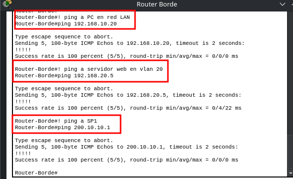
> Se verifica que el router borde (gateway inter-VLAN) tiene conectividad con:
> 
> - `192.168.10.20` → PC en VLAN 10 (LAN interna)
>     
> - `192.168.20.5` → Servidor web en VLAN 20 (DMZ)
>     
> - `200.10.10.1` → ISP1 (salida a Internet)

&ensp;
---

&ensp;


&ensp;

_✅ La red ya está segmentada. Las VLANs funcionan. Los puertos están asegurados. Y  se verifico conectividad_

 _Pero hay un problema: el tráfico entre VLANs aún fluye sin restricciones. Un atacante en la DMZ podría intentar moverse a la LAN interna._

 _🔒 **En la Parte 2:** Reemplazaremos este router Cisco por **pfSense**, aplicaremos reglas de firewall para aislar la DMZ, configuraremos un IDS (Suricata) para detectar escaneos, y montaremos una VPN para acceso remoto seguro._

*👉  [Enlace a la Parte 2 - Próximamente]*
