---

title: "Diseño e Implementación de Infraestructura de red segura Parte 2"
date: 2026-05-08
draft: false
tags: ["Redes", "Arquitectura", "pfSense", "DMZ", "OpenVPN", "Suricata", "Wireshark", "Hardening"]
description: "Segunda parte de implementación de seguridad en una red empresarial"


---


&ensp;

### 📘 Enfoque del Proyecto

 Este artículo no pretende ser un tutorial técnico paso a paso, sino un **Caso de Estudio sobre arquitectura de seguridad**. El objetivo es demostrar cómo una organización con presupuesto limitado puede transformar una infraestructura crítica vulnerable en una fortaleza digital utilizando soluciones **Open Source**.
 
 Cada decisión técnica aquí expuesta fue tomada priorizando el equilibrio entre la **seguridad robusta** y la **continuidad operativa**, evitando soluciones innecesariamente complejas que pudieran sobrecargar la administración de una red de aproximadamente 35 hosts.

&ensp;

> **❕:** Esta es la continuación directa de la [Parte 1](https://ratfl.github.io/Netrunner/posts/red_segura/). Si no la has leído, te recomiendo empezar allí, donde configuramos VLANs, troncales, STP y seguridad de puertos. En esta segunda parte, **reemplazamos el router Cisco temporal por pfSense** para añadir el cerebro de la seguridad: firewall, IDS y acceso remoto cifrado.

&ensp;

&ensp;

## 📖 En este post (Parte 2):

- pfSense (aclaración metodológica)
    
- Reglas de firewall: aislamiento DMZ → LAN
    
- Port forwarding para servicios públicos (web)
    
- IDS Suricata con reglas personalizadas 
    
- OpenVPN para acceso remoto seguro
    
- Hardening en servidores

&ensp;

---

&ensp;

## 🔥 1. De router Cisco a pfSense: por qué este cambio es crucial

En la Parte 1 usamos un router Cisco en Packet Tracer **solo para validar que las VLANs y los trunks funcionaban**. Pero un router convencional no tiene firewall de verdad, ni IDS, ni VPN. Por eso, en la solución real, el encargado de **enrutar entre VLANs y aplicar seguridad** será **pfSense**.

&ensp;

**_Como Packet Tracer no soporta pfSense. La implementación de firewall, IDS y VPN se realizó en un entorno de máquinas virtuales (pfSense + Ubuntu Server + Windows Server), replicando fielmente la topología diseñada._**


&ensp;

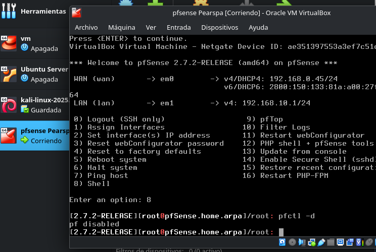

> 📌 **Sobre el entorno virtual:** Para respetar el aislamiento entre LAN y DMZ, se configuraron dos redes internas en VirtualBox: `LAN_VM` (192.168.10.0/24) y `DMZ_VM` (192.168.20.0/24) respetando las redes asignadas a cada VLAN en el diseño de red. Cada una corre en una máquina virtual diferente, emulando la separación física que exige una DMZ real.

&ensp;

### Una vez instalado pfSense, accedemos a su interfaz web para empezar a configurar el firewall:

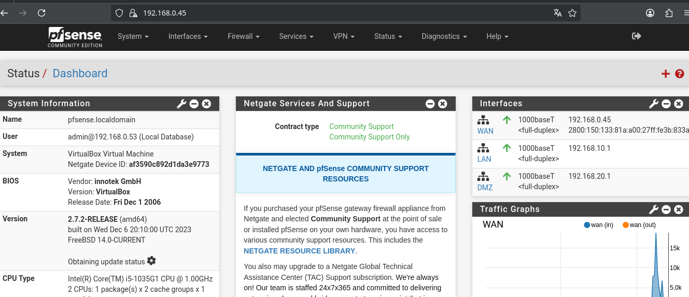

&ensp;

---

&ensp;

&ensp;

## 🚫 2. Reglas de firewall: el corazón de la segmentación

El objetivo principal es **aislar la DMZ** (donde está el servidor web) de la **LAN interna** (donde están los datos sensibles y el controlador de dominio). Con pfSense aplicamos dos tipos de reglas:

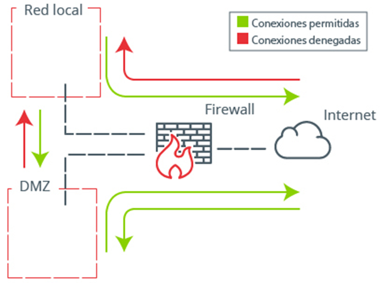


&ensp;

### ✅ 2.1 Regla que permite salida desde DMZ a Internet

El servidor web necesita actualizarse y consultar servicios externos. Creamos una regla que permite **todo el tráfico desde DMZ hacia WAN**:

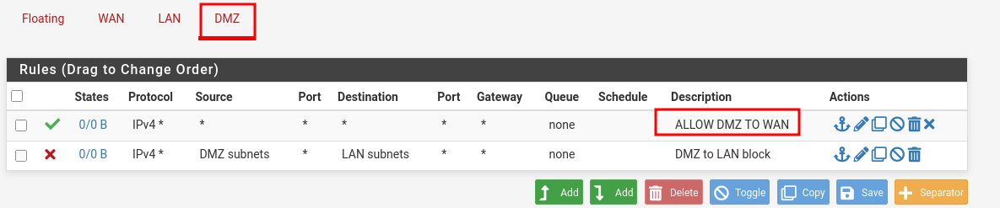

&ensp;

### Y lo comprobamos haciendo un ping a `8.8.8.8` desde el servidor web (vía SSH):

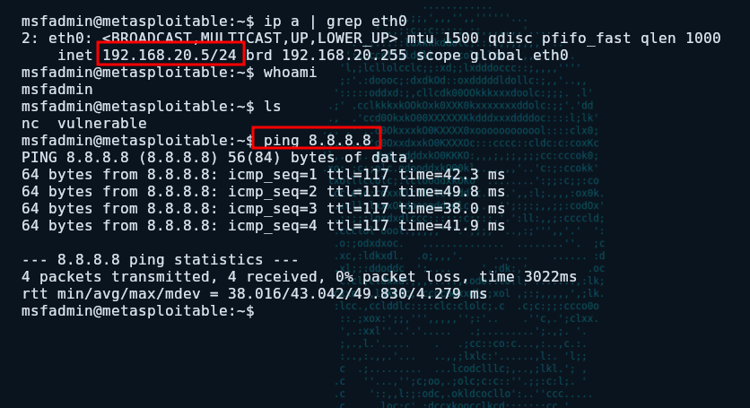

&ensp;

&ensp;

### ❌ 2.2 Regla que bloquea todo tráfico de DMZ a LAN (la más importante)

Si el atacante compromete el servidor web, **no debe poder moverse lateralmente** hacia la LAN. Esta regla lo impide:

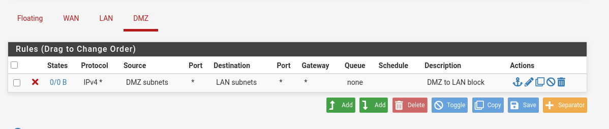

&ensp;

Validamos la regla haciendo un ping desde la DMZ a un PC de la LAN (`192.168.10.2`) y **no hay respuesta**:

### **Esto es exactamente lo que evita el movimiento lateral. El atacante queda atrapado en la DMZ**

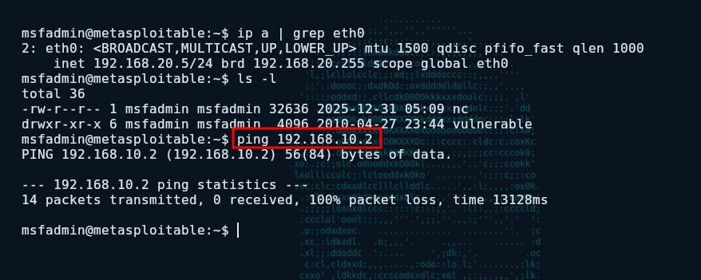


&ensp;

&ensp;


### ✅ 2.3 Comunicación legítima: LAN → DMZ y LAN → Internet

Los usuarios de la LAN sí deben poder acceder al sitio web público (por ejemplo, para consultar la aplicación web). Por lo tanto, el tráfico **desde LAN hacia DMZ está permitido** además de tener salida a internet:


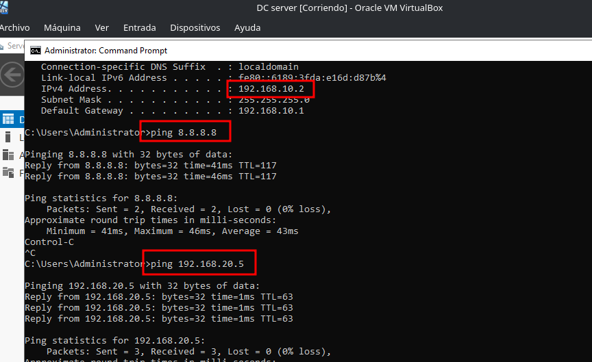

&ensp;


> 📌 **Resumen de flujos:**
> 
> - `WAN → DMZ`: solo servicios publicados (web, SSH mediante port forwarding).
>     
> - `DMZ → WAN`: permitido (actualizaciones, consultas externas).
>     
> - `DMZ → LAN`: **bloqueado totalmente**.
>     
> - `LAN → DMZ`: permitido (usuarios ven el sitio web).
>     
> - `LAN → WAN`: permitido.
>     
> - `WAN → LAN`: **bloqueado** (solo se accede por VPN).

&ensp;

---

&ensp;


## 🔌 3. Port forwarding (DNAT): publicando servicios de forma controlada

&ensp;


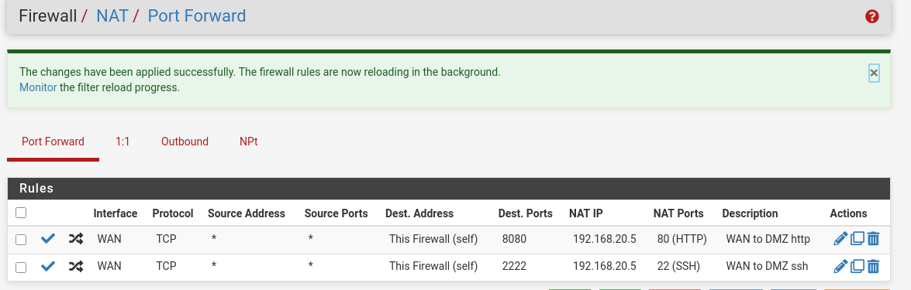

&ensp;

Para que los clientes de Internet puedan acceder al **sitio web** público, usamos Port Forwarding en pfSense:

- El puerto **8080** de la WAN se redirige al puerto **80** del servidor web en DMZ.
    

Esto permite que cualquier usuario navegue por el sitio web sin necesidad de VPN.

&ensp;

✅ **Comprobación del acceso web desde WAN:**

_Acceso al servidor web desde un navegador en la WAN (8080 → 80)_


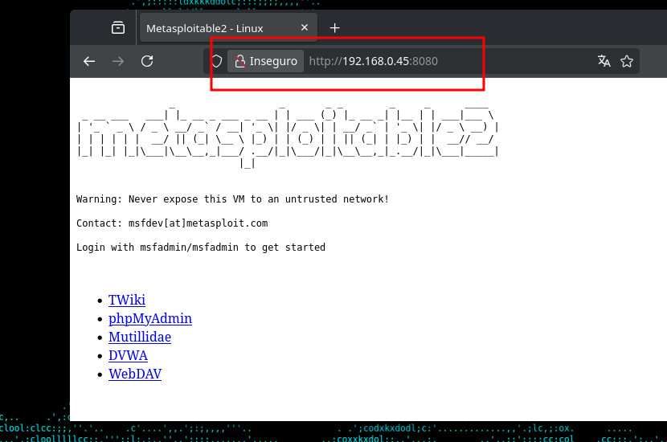

&ensp;

### 🚨 Importante: SSH no se debe de exponer directamente

En la demostración técnica también configuramos una regla de port forwarding para SSH:

- Puerto **2222** de la WAN → puerto **22** del servidor web en DMZ.
    

**Esto se hizo ÚNICAMENTE para validar que la redirección funciona y para que Suricata generara las alertas correspondientes.** En un entorno de producción real, **no se debe exponer SSH directamente a Internet**, ni siquiera en puertos altos. El acceso administrativo (SSH a Linux, RDP a Windows) debe realizarse **exclusivamente a través de la VPN** que configuramos más adelante

Por tanto, la regla de port forwarding para SSH **se desactivará o eliminará** una vez finalizadas las pruebas. La regla que realmente permanecerá activa es la de la web (8080 → 80), pues es de público acceso.


&ensp;


✅ **Comprobación del acceso SSH desde WAN (solo para demostración):**


`Conexión SSH desde WAN al puerto 2222 (redirige a puerto 22 del servidor DMZ), se tuvo que utilizar un comando el cual permitiese ignorar la incompatibilidad criptográfica entre la versión SSH de Metasploitable y el SSH en mi máquina.`

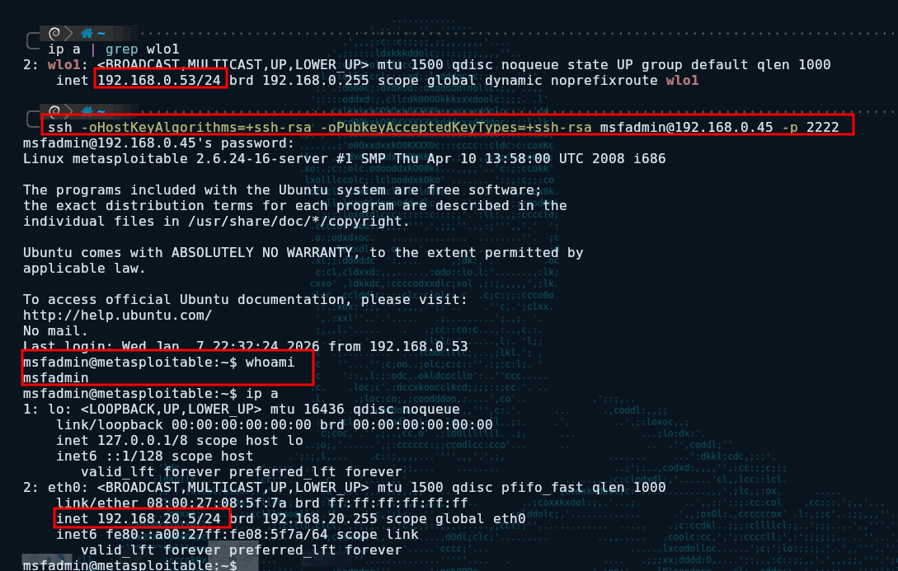

&ensp;


&ensp;

---

&ensp;

&ensp;


## 🕵️‍♂️ 4. IDS Suricata: detección personalizada de los ataques que encontramos en el forense

En la Parte 1 identificamos tres comportamientos maliciosos concretos:

1. **`Escaneo de puertos`**
    
2. **`Subida de archivo malicioso`** (POST a `/upload` + reverse shell)
    
3. **`Fuerza bruta contra SSH`**
    

Ahora, **Suricata** (en modo IDS pasivo) monitoriza todo el tráfico que pasa por la interfaz WAN de pfSense y **genera alertas** ante esos patrones. Creamos reglas personalizadas para cada caso.

&ensp;

## 📡 Regla 1: Detección del SYN scan


Como se vio en la primera parte de este post, encontramos un SYN scan (half-open) con Wireshark. Era la fase de reconocimiento del atacante. Ahora, Suricata lo detecta automáticamente gracias a una regla personalizada que implemente para este proyecto.

_Sintaxis de la regla:_

```text
alert tcp any any -> 192.168.0.45 any (msg:"[ALERTA] Escaneo de puertos SYN detectado"; flags:S; threshold:type threshold, track by_src, count 20, seconds 10; sid:100004; rev:1; classtype:attempted-recon; priority:3;)
```
&ensp;


### _Alerta generada_

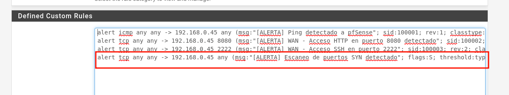

&ensp;


### **¿Qué hace esta regla?**

- `flags:S` → Busca paquetes TCP con solo el flag SYN activo (el saludo inicial de un escaneo half-open).
    
- `threshold:type threshold, track by_src, count 20, seconds 10` → Solo alerta cuando una misma IP origen envía **20 o más SYN** en un intervalo de **10 segundos**. Esto evita falsos positivos (por ejemplo, una conexión legítima que falla y reintenta) y se enfoca en comportamientos de escaneo.
    
- `classtype:attempted-recon` → Clasifica el evento como "intento de reconocimiento", una categoría estándar en IDS.
    

Con esta regla, **cualquier escaneo de puertos tipo SYN desde la WAN generará una alerta en tiempo real**.

&ensp;


### ✅ Validación: lanzamos un escaneo Nmap y Suricata responde

Lanzamos un escaneo desde un host atacante en la WAN a la IP de pfSense (`192.168.0.45`), ejecutamos:


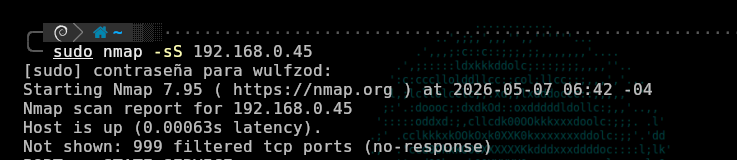


&ensp;

El IDS Suricata, que monitoriza la interfaz WAN de pfSense, genera **múltiples alertas** en su archivo `alerts.log`:

Cada línea corresponde a un puerto escaneado. El IDS está registrando cada paquete SYN que supere el umbral establecido, lo que demuestra que la regla funciona perfectamente

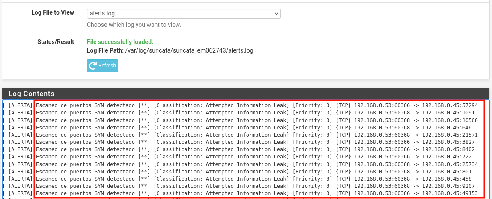


&ensp;

> El mismo comportamiento que detectamos en el .pcap durante el análisis forense **ahora es identificado automáticamente por Suricata**. El atacante ya no puede mapear la red sin dejar rastro.

&ensp;


### 📡 Regla adicional: Detección de ping 

los atacantes suelen usar técnicas o diferentes combinaciones de escaneos para pasar desapercibidos y evitar falsos positivos en el sistema. Por ello, he optado por una **regla de Suricata para el ICMP inicial (Ping)** por tres razones:

- **Detección Temprana:** El ping es el primer paso casi obligatorio para confirmar que un objetivo está "vivo" (aunque nmap permite saltarse esto con la flag `-Pn`).
- **Claridad:** En una red segura, nadie desde el exterior debería hacer ping a nuestra infraestructura. Cualquier intento es, por definición, sospechoso.
- **Eficiencia:** Es mejor identificar y bloquear al atacante en su primer contacto que esperar a que analice los servicios.

&ensp;


Sintaxis de la regla:


```text
alert icmp any any -> 192.168.0.45 any (msg:"[ALERTA] Ping detectado a pfSense"; sid:100001; rev:1; classtype:icmp-event; itype:8; threshold: type limit, track by_src, count 1, seconds 10; priority:2;)
```

&ensp;

### _ping desde WAN a pfSense_

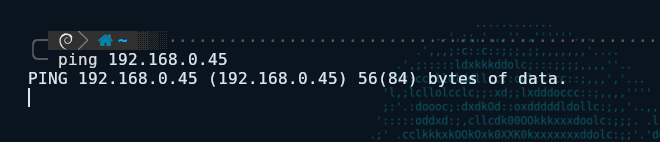

&ensp;

### _ping detectado_

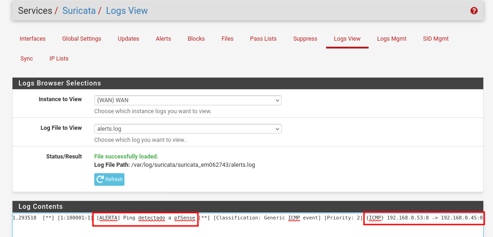

&ensp;

### _Video demostrativo:_



&ensp;

> "❕: La IP WAN de pfSense varía entre 192.168.0.45 y 192.168.1.10 en las capturas debido a reconfiguraciones por cambio de ubicación (trabajo/hogar). La funcionalidad no se ve afectada."


&ensp;


&ensp;

### 🌐 Regla 2: Detectar el ataque original – POST a `/upload`

Recordarás que en los logs de Apache aparecía un `POST /upload` seguido de varios `GET`. Lo que indicaba la subida de una reverse shell. Creamos una regla que alerta exactamente ante ese método y URI:

Sintaxis de la regla:


```text
alert tcp any any -> 192.168.0.45 8080 (msg:"[ALERTA] WAN - Acceso HTTP en puerto 8080 detectado"; sid:100002; rev:1; classtype:web-application-attack; flow:to_server,established; content:"GET"; http_method; threshold: type limit, track by_src, count 3, seconds 10; priority:3;)
```

&ensp;

### _Alerta generada_

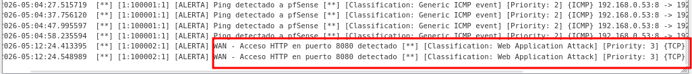

&ensp;

Si el atacante vuelve a intentar subir su shell, **deja huella inmediata**. El administrador recibe la alerta y puede bloquear la IP o tomar medidas.

&ensp;



&ensp;

&ensp;

### 🔐 Regla 3: Detectar fuerza bruta SSH

También creamos una regla que genera una alerta cada vez que se intenta conectar al puerto 2222 (redirigido al SSH del servidor web):

&ensp;

Sintaxis de la regla:


```text
alert tcp any any -> 192.168.0.45 2222 (msg:"[ALERTA] WAN - Acceso SSH en puerto 2222"; sid:100003; rev:2; classtype:attempted-admin; flow:to_server,established; content:"SSH-"; depth:4; threshold: type limit, track by_src, count 1, seconds 10; priority:2;)
```

&ensp; 

**Alerta generada al conectarnos por SSH desde WAN**

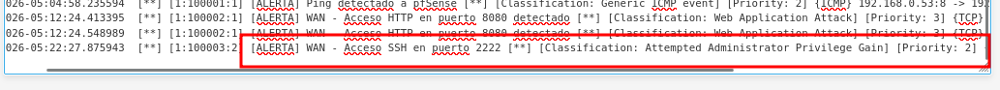
&ensp;

> **❕** En un entorno productivo, esta regla se afinaría con una whitelist de IPs administrativas para evitar falsos positivos. Para la demostración, nos sirve para mostrar que **cualquier intento de SSH queda registrado**.

&ensp;



&ensp;

&ensp;

---


&ensp;


## 🔐 5. OpenVPN: acceso remoto seguro sin exponer RDP/SSH

Antes, EcoSeaSystem exponía directamente los puertos SSH (22) y RDP (3389) a Internet, lo que facilitaba ataques de fuerza bruta. La solución es **cancelar esa exposición y exigir VPN** para cualquier administración remota.

Configuramos un servidor **OpenVPN** en el propio pfSense. El proceso general incluye:

1. Crear una **Autoridad Certificadora (CA)** y un **certificado de servidor**.
    
2. Configurar el servidor OpenVPN (SSL/TLS + autenticación por usuario/contraseña).
    
3. Añadir una **regla de firewall** en la interfaz WAN que permita el tráfico UDP al puerto 1194.
    
4. Crear un **usuario** y descargar su certificado cliente (archivo `.ovpn`).
    
5. Conectar el cliente usando `openvpn --config cliente.ovpn`.


&ensp;

**`Configuración del servidor OpenVPN (SSL/TLS + autenticación por usuario/contraseña)`**


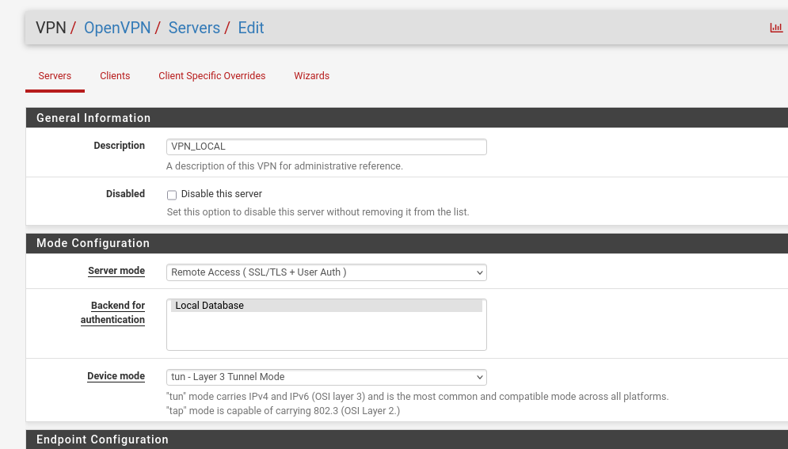

&ensp;


 **`Regla de firewall para permitir VPN en puerto UDP 1194 desde WAN`**
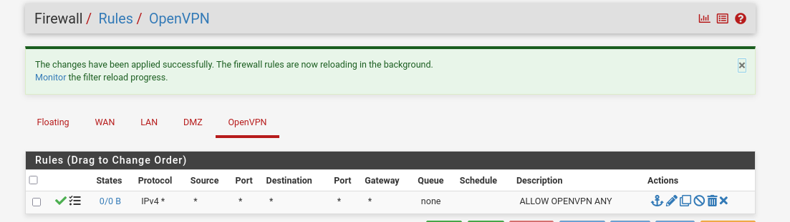

&ensp;


Una vez conectado, el administrador obtiene una IP virtual (por ejemplo, `10.8.8.x`) y puede acceder a los servidores por su IP privada **como si estuviera dentro de la red local**. La conexión está completamente cifrada y los puertos de administración (SSH, RDP) **no quedan expuestos a Internet**.

&ensp;



&ensp;

> Con esta configuración, PearSPA elimina por completo la superficie de ataque de los servicios de administración remota. Cualquier intento de conexión SSH o RDP directo desde WAN es bloqueado por el firewall; solo quienes tengan el certificado y credenciales de la VPN pueden acceder.

&ensp;

---

&ensp;


## 🛡️ Fase 5: Hardening de Sistemas

Una red segura no es suficiente si los servidores internos mantienen puertas abiertas. El **Hardening** consiste en minimizar la superficie de ataque eliminando funciones, puertos y permisos innecesarios que un atacante podría explotar tras una intrusión inicial.

### 🐧 5.1. Seguridad en Entornos Linux (Ubuntu Server)

Para el servidor web y de archivos, el enfoque fue la limpieza y la auditoría profunda de permisos:

- **Auditoría con LinPEAS:** Herramientas de enumeración para detectar de forma automatizada vectores de escalada de privilegios, como archivos con bits **SUID** mal configurados, **capabilities** excesivas en binarios y servicios expuestos innecesariamente.
    
- **Reducción de Superficie:** Se deshabilitaron todos los puertos y servicios sin uso operativo (como el caso del servicio `vsftpd` vulnerable detectado en la Fase 1).
    
- **Control de Acceso:** Refuerzo del servicio SSH mediante el uso exclusivo de llaves públicas y la deshabilitación del acceso directo como usuario _root_.


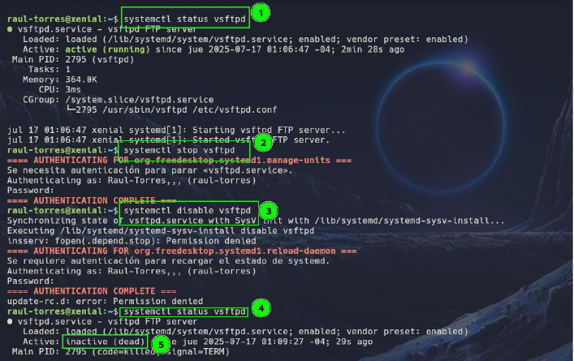


&ensp;

&ensp;


### 🪟 5.2. Seguridad en Windows Server 2019 (Active Directory)

En el corazón de la gestión de identidades de EcoSea Systems, las medidas se centraron en el control de privilegios:

* Principio de Mínimo Privilegio: Reestructuración de grupos y permisos en el Active Directory para asegurar que cada usuario y servicio tenga estrictamente lo necesario para su función.

* Auditoría de Directorio Activo: Para organizaciones de este tamaño, es vital el uso de herramientas como BloodHound para visualizar rutas de ataque de escalada de privilegios, o alternativas más ligeras como PingCastle para obtener un reporte rápido del estado de salud y seguridad del AD.

* Políticas de Grupo (GPO): Implementación de políticas para el endurecimiento de contraseñas, bloqueo de cuentas ante ataques de fuerza bruta y restricción de ejecución de scripts no firmados.

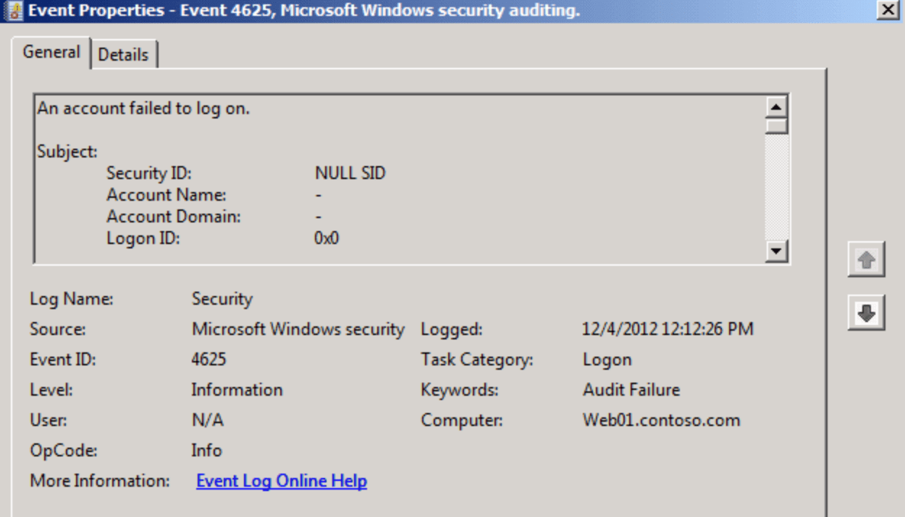

&ensp;


&ensp;


---


&ensp;

## ✅ Conclusión: De red plana a defensa en profundidad

EcoSea System partió siendo un ejemplo clásico de PYME vulnerable: red plana, servicios expuestos, sin controles perimetrales ni visibilidad. En la **Parte 1** segmentamos la red con VLANs, aseguramos los puertos y blindamos la capa de conmutación.

En esta **Parte 2** completamos la transformación:

- 🔥 **pfSense** aplica reglas estrictas que aíslan la DMZ de la LAN.
    
- 🕵️‍♂️ **Suricata** detecta escaneos SYN, fuerza bruta y el mismo ataque `/upload` que encontramos en el forense.
    
- 🔐 **OpenVPN** elimina la exposición de RDP y SSH a Internet.
    

El resultado es una infraestructura **segmentada, monitoreada y con acceso remoto seguro**, construida íntegramente con software de código abierto y hardware accesible. La misma inversión que haría cualquier PYME.

&ensp;

> _"El atacante no entró por magia. Entró porque la puerta estaba abierta. Ahora no solo está cerrada, sino que tiene alarma, vigilancia y llave única."_

&ensp;

## 📌 **¿Qué sigue?** Centralización de logs con ELK, un WAF ligero, Suricata en modo IPS, WAZUH, MFA ¿?. Quizás en una próxima implementación. Pero con lo que ya tenemos, EcoSea System ya no es un blanco fácil.
