---

title: "Análisis de Ataque NTLM Relay en HTB Reaper"
date: 2026-04-22
draft: false
tags: ["NTLMRelay", "BlueTeam", "Wireshark", "WindowsForensics", "ActiveDirectory", "DFIR"]
description: "Análisis y correlación de PCAP + EVTX log para detectar y mitigar un ataque de retransmisión NTLM en entorno AD."

---
&ensp;

&ensp;

## `Descripción`

Reaper es un Sherlock very easy que cubre los ataques de retransmisión NTLM, incluyendo análisis forense de Active Directory, detección de ataques Man-in-the-Middle y análisis forense de redes. En este Sherlock, los jugadores analizarán el tráfico de red y los registros de eventos de Windows para encontrar evidencia de ataques de retransmisión NTLM, comunes en entornos de Active Directory.

## `Escenario`

Nuestro SIEM nos alertó sobre un inicio de sesión sospechoso que requiere atención inmediata. La alerta indicaba una discrepancia entre la dirección IP y el nombre de la estación de trabajo de origen. Se le proporciona una captura de red y registros de eventos del período cercano al incidente. Correlacione la evidencia proporcionada e informe a su gerente del SOC.

## `Preparación`

Como primer paso para empezar con la resolución de este Sherlock debemos de descargar el archivo .zip de la plataforma Hack The Box, al descomprimirlo obtendremos una captura de red llamada **ntlmrelay.pcap**  y el log de seguridad de Windows **Security.evtx**.
Como el análisis lo realizare desde una máquina Linux, necesitare dos herramientas: 
`evtx_dump.py:` Nos permitirá convertir archivos de registro de eventos de Windows (`.evtx`) en formatos legibles como XML o JSON, facilitando analizar logs de Windows en Linux.
`Wireshark:` Para analizar el archivo `.pcapng` y de esta forma filtrar e inspeccionar el tráfico de red capturado.

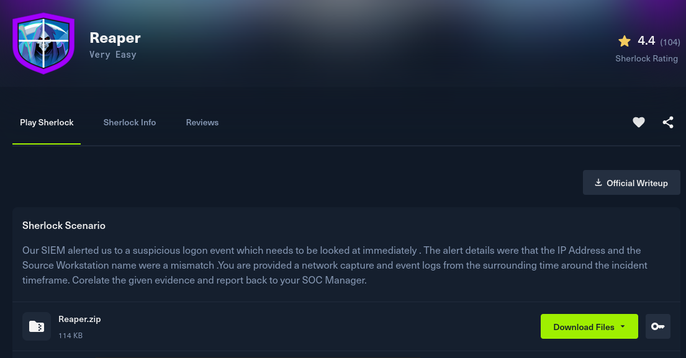

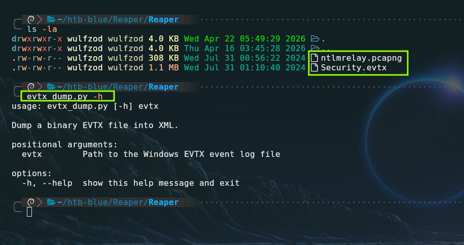

&ensp;

---

&ensp;

## Resolución del Laboratorio

### `Task 1:` What is the IP Address for Forela-Wkstn001?

La primera tarea que se nos asigna consiste en identificar la dirección IP de la estación de trabajo `Forela-Wkstn001`. Para encontrar la IP filtramos por el protocolo nbns (NetBIOS Name Service), podremos ver que la IP **172.17.79.129** esta enviando un paquete nbns a la IP 172.17.79.2 (Posible DC o servidor WINS), esto es equivalente a que la máquina se presente diciendo: `"Hola, soy FORELA-WKSTNO01 y mi IP es 172.17.79.129”.`

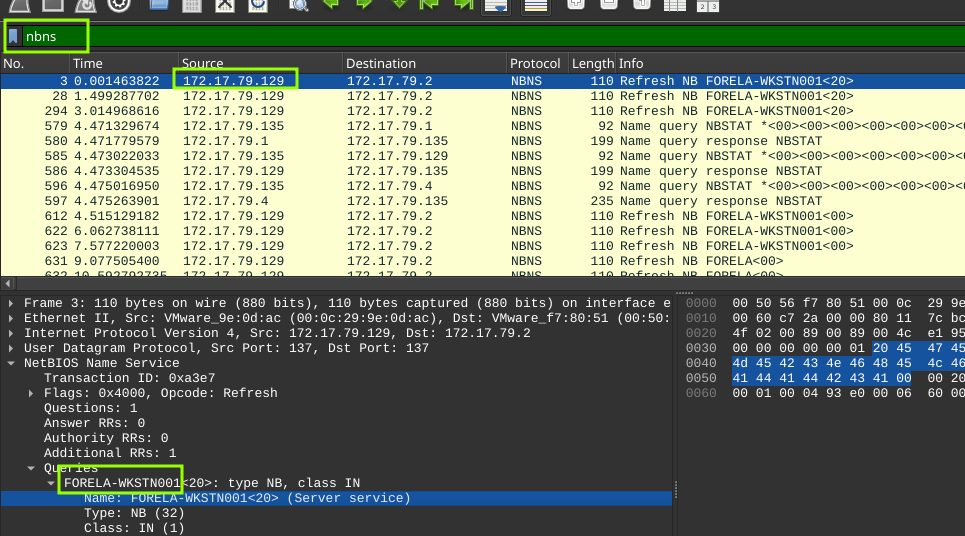

&ensp;

### `Respuesta:` 172.17.79.1 ✔️

&ensp;

---

&ensp;

### `Task 2:` What is the IP Address for Forela-Wkstn002

En esta tarea se nos pide dar con la dirección IP de `Forela-Wkstn002`, si miramos un poco más abajo podremos encontrar la dirección IP de esta segunda estación de trabajo.

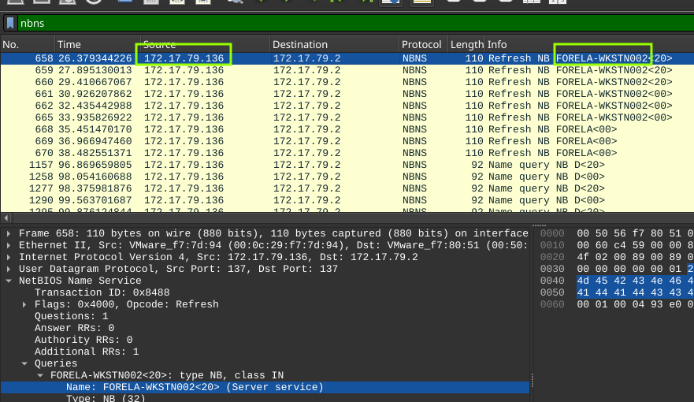

&ensp;

### `Respuesta:` 172.17.79.136 ✔️

&ensp;

----

&ensp;

### `Task 3:` What is the username of the account whose hash was stolen by attacker?

En este tercer encargo debemos de encontrar el nombre del usuario cuyo hash fue robado por el atacante, filtraremos en Wireshark por el protocolo `ntlmssp` el cual es un protocolo de autenticación de Microsoft que utiliza un mecanismo de "desafío-respuesta" para verificar la identidad de los usuarios sin enviar contraseñas directamente por la red. El ataque de `NTLM Relay` aprovecha la estructura de los mensajes que transporta `ntlmssp` para engañar a un servidor y permitir que un atacante suplante a un usuario legítimo.

En los primeros paquetes se puede apreciar el proceso de negociación `ntlmssp`, siendo el tercer paquete (de arriba hacía abajo) el cual contiene el nombre del usuario que buscamos.

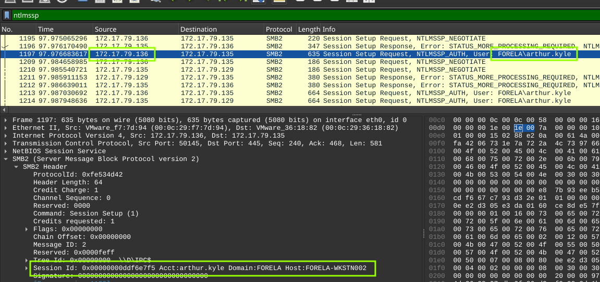

&ensp;

Podemos confirmarlo analizando el log **Security.evtx** con la herramienta **evtx_dump.py**. En el output del comando se aprecia lo siguiente:

**TargetUserName**: arthur.kyle

**TargetDomainName**: FORELA

**LogonType**: 3  (Autenticación de red SMB)

**LogonProcessName**: NtLmSsp  (Proceso NTLM SSP)

**AuthenticationPackageName**: NTLM (Protocolo NTLM)

**Computer**: Forela-Wkstn001.forela.local (Máquina donde se validó el hash)

Aunque las credenciales pertenecen a `arthur.kyle` (quien opera normalmente desde la IP `.136`), la conexión técnica para validar esas credenciales se originó desde un punto distinto para acceder a la IP `.135`.  

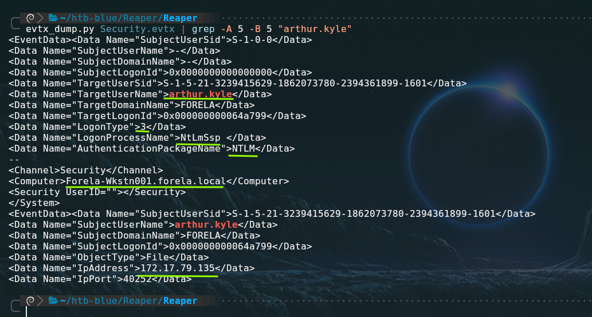

&ensp;

### `Respuesta:` arthur.kyle ✔️

&ensp;

---

&ensp;

### `Task 4:` What is the IP Address of Unknown Device used by the attacker to intercept credentials?

La respuesta a esta pregunta se puede deducir de la captura de Wireshark vista anteriormente, ya que la IP `.135` actuó como el relay NTLM, recibió la autenticación legítima de `arthur.kyle` desde la `.136`, capturó el hash NTLM, y lo retransmitió hacia `Forela-Wkstn001 (IP .129)` para obtener acceso no autorizado a recursos del dominio.

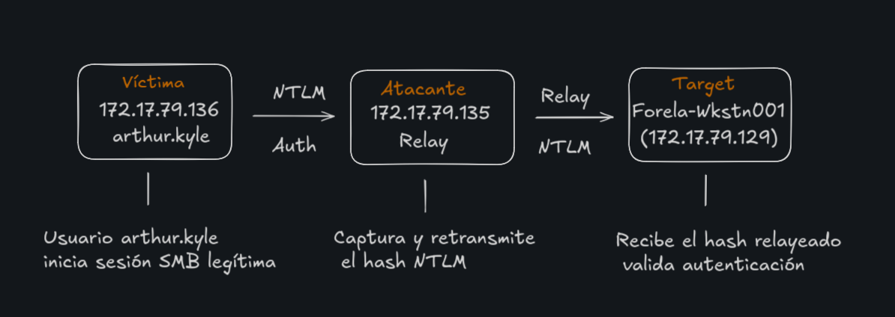

&ensp;

###  `Respuesta:` 172.17.79.135 ✔️

&ensp;

---

&ensp;

### `Task 5:` What was the fileshare navigated by the victim user account?

En la quinta tarea nos preguntan cual es el fileshare al que intento acceder la víctima. Para dar con el nombre del share podemos filtrar por smb2 (protocolo relacionado a fileshare y recursos compartidos) junto con la IP de la víctima `.136` (arthur.kyle), debemos de fijarnos en los campos `Tree Connect Request` Tree lo cual indica que el cliente está intentando acceder a una carpeta compartida específica,  podemos ver múltiples mensajes de error seguidos de solicitudes de conexión a `\\DC01\Trip`.

En el paquete n.º 1411 se puede ver un intento de conexión a `\\DC01\IPC$` esto se debe descartarse ya que el sistema se conecta a él automáticamente como parte de la negociación inicial de SMB

`Nota: \\DC01\Trip` no es un recurso real, sino un nombre de destino ficticio. Su función es forzar a la víctima a iniciar una negociación SMB. Al hacerlo, la víctima envía su desafío/respuesta NTLM, lo que permite al atacante interceptar y retransmitir (Relay) dicha autenticación hacia otro objetivo para ganar acceso sin conocer la contraseña. El error `BAD_NETWORK_NAME`visto en Wireshark es la prueba forense de que el recurso era falso.

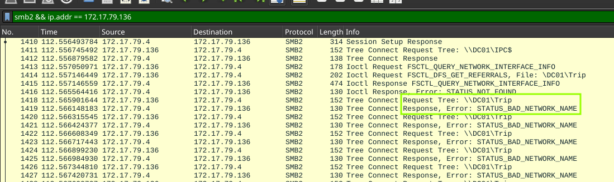

&ensp;

###  `Respuesta:` \\DC01\Trip ✔️

&ensp;

---

&ensp;

### `Task 6:` What is the source port used to logon to target workstation using the compromised account?

En esta tarea debemos de dar con el puerto de origen utilizado para logearse a la máquina objetivo, si filtramos el log de la siguiente forma podremos dar con el puerto:  
`evtx_dump.py Security.evtx | grep -E -A 40 "4624|NtlmSSP" | grep -E "IpPort\">[1-9][0-9]" -B 33`  
`Nota:` Se utiliza una regex para indicar que se busca un campo IpPort diferente de “0” con el fin de filtrar el exceso de ruido.

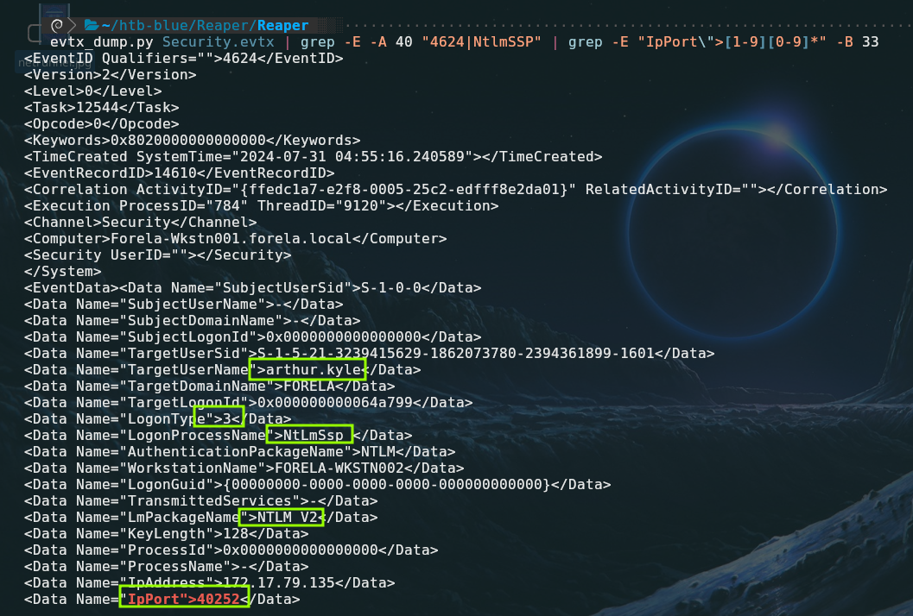

&ensp;

Datos clave del output de evtx_dump.py:
**EventID 4624:** Indicativo de un inicio de sesión correcto.

**SystemTime=“2024-07-31 04:55:16.240589”:** De utilidad para hacer correlación con otra evidencia, el pcapng por ejemplo.

**TargetUserName> arthur.kyle:** Confirma que la cuenta comprometida fue **arthur.kyle**. Como es un ataque de relay, Arthur no puso su contraseña; el atacante "retransmitió" la prueba de identidad de Arthur desde otra conexión.

**LogonType 3 (Network):** Indica un inicio de sesión a través de la red vía SMB.

**LogonProcessName: NtLmSsp:** Indica que el proceso encargado de la autenticación fue el `NTLM Security Support Provider` vulnerable a ataques de relay.

**LmPackageName: NTLM V2:** Confirma que se utilizó la versión 2 de NTLM. Aunque es más segura que la V1 contra el crackeo por fuerza bruta, sigue siendo completamente vulnerable a ser retransmitida (relay) si la firma SMB (**_SMB Signing_**) no está activada como obligatoria.**

**IpPort: 40252:** Puerto origen de la máquina atacante.

Se puede confirmar en Wireshark el flujo del relay donde el atacante actúa como un "hombre en el medio" entre la víctima y el objetivo confirmando que el puerto de destino es el 40252 .

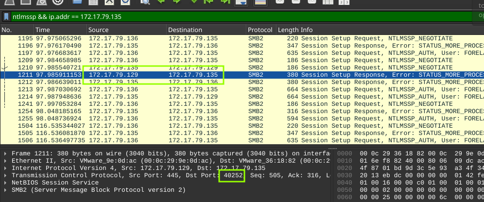

&ensp;

### `Respuesta:` 40252** ✔️

&ensp;

---

&ensp;

###  `Task 7:` What is the Logon ID for the malicious session?

Se nos pide encontrar el ID del login malicioso, este se puede extraer del output del comando `evtx_dump.py Security.evtx | grep -E -A 40 "4624|NtlmSSP" | grep -E "IpPort\">[1-9][0-9]*" -B 33` en el campo `TargetLogonId` solo hay que quitar los “0” de relleno.

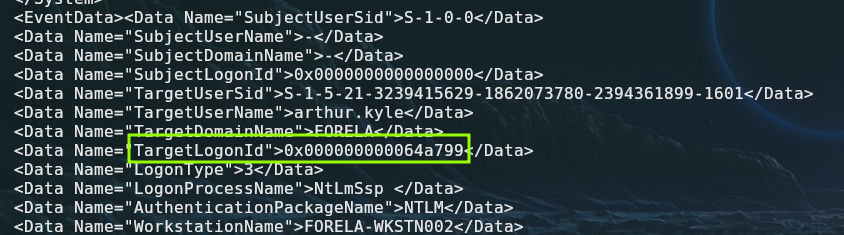

&ensp;

##  `Respuesta:` 0x64A799 ✔️

&ensp;

---

&ensp;

### `Task 8:` The detection was based on the mismatch of hostname and the assigned IP Address.What is the workstation name and the source IP Address from which the malicious logon occur?

En la Tarea n°8 nos piden identificar el nombre del workstation y la IP las cuales se usaron para logearse de forma maliciosa y en las cuales hay una discrepancia.
La dirección IP y el nombre de la estación desde donde ocurrio el login son `FORELA-WKSTN002/172.17.79.135`, pero la discrepancia de la que habla la pregunta se debe a que el verdadero nombre de esta máquina con IP `.135` es `E90GH1DCE`. Esto sucede porque, en un ataque de Relay, el atacante funciona como un impostor, usa su propia conexión física (su IP) pero presenta la identificación de otra persona para engañar al sistema y lograr que le abra la puerta.
Para dar con el verdadero nombre de la estación de trabajo cuya IP es la `.135` podemos ayudarnos del protcolo DHCP y encontrar el verdadero hostname antes de que este fuera manipulado por el atacante.

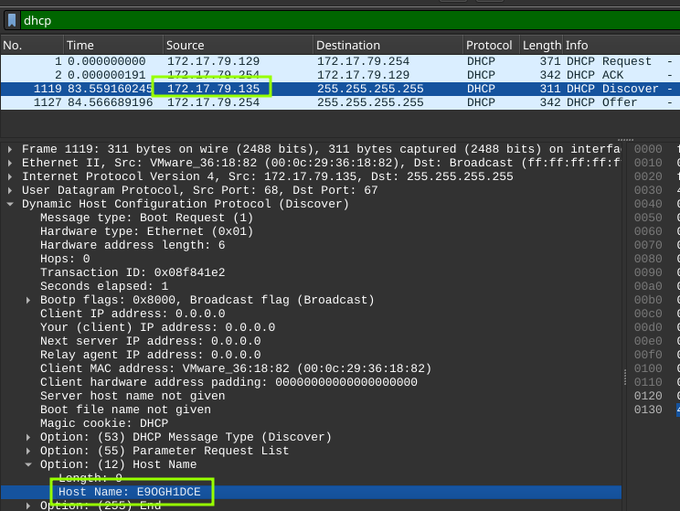

&ensp;

### `Respuesta:` FORELA-WKSTN002, 172.17.79.135 ✔️

&ensp;

---

&ensp;

### `Task 9:` At what UTC time did the the malicious logon happen?

La fecha y hora del login “malicioso” aparece en el mismo output del log del evento 4624.

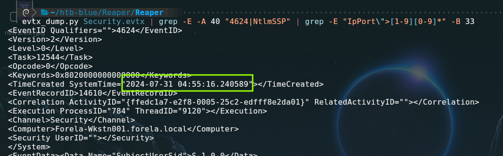

&ensp;

### `Respuesta:` 2024-07-31 04:55:16 ✔️

&ensp;

---

&ensp;

### `Task 10:` What is the share Name accessed as part of the authentication process by the malicious tool used by the attacker?

Se nos pide dar con el nombre del Share de red al cual se accede de forma automática como parte del proceso de autenticación, el cual es `\\*\IPC$` , Windows utiliza un comodin `“*”` para representa una conexión entrante al canal de comunicación interna, sin importar qué alias o dirección usó el cliente para llegar ahí.

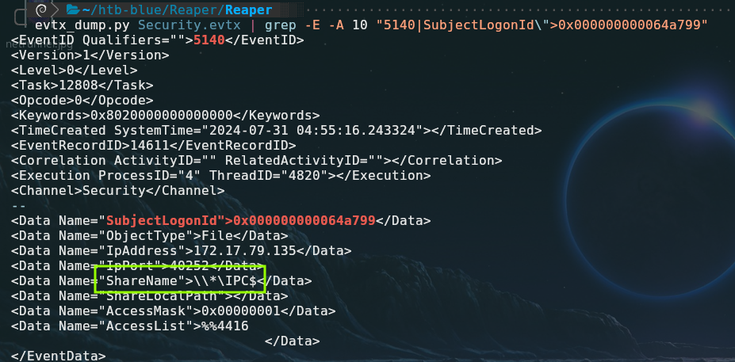

&ensp;

### `Respuesta:` \\*\IPC$ ✔️

&ensp;

---

&ensp;

## `Conclusión`

El análisis forense permitió identificar un ataque de **NTLM Relay** exitoso, donde se detectó que el atacante (IP **172.17.79.135**, nombre real **E90GH1DCE**) engañó a un usuario legítimo mediante un recurso señuelo para retransmitir su autenticación hacia un servidor objetivo. Este compromiso fue confirmado al cruzar el tráfico de red (PCAP), que mostraba errores de conexión a rutas inexistentes, con los logs de seguridad (EVTX), donde se evidenció una discrepancia de identidad entre la IP del atacante y el nombre de la víctima. Para mitigar este riesgo, es crítico **requerir el firmado SMB (SMB Signing)** en toda la red, deshabilitar protocolos de resolución de nombres heredados como LLMNR/NBNS y, idealmente, transicionar hacia la autenticación mediante **Kerberos**, que neutraliza este vector de suplantación.

&ensp;

