---

title: "Análisis forense de una brecha en nube privada (OpenStack) Vantage (HTB)"
date: 2026-04-26
draft: false
tags: ["Cloud", "BlueTeam", "Wireshark", "DFIR", "MITRE ATT&CK", "OpenStack"]
description: "DFIR en nube privada: análisis PCAP para detectar fuzzing, movimiento lateral y persistencia en OpenStack."

---
&ensp;


&ensp;

## `El incidente`

Una empresa migró recursos a una nube privada. Los desarrolladores dejaron una redirección activa en el servidor web. Días después, el equipo de seguridad recibió un correo del atacante: *"los datos de los usuarios están en mi poder"*.

Solo tenemos dos archivos pcap para descubrir lo que paso 🔎 

&ensp;

## `¿Para quién es este análisis?`

Si te interesa el DFIR, blue team o seguridad en la nube, este lab te mostrará cómo un atacante real se mueve desde un servidor web expuesto hasta la exfiltración de datos en OpenStack.

&ensp;

---

&ensp;

## `Resolución del Laboratorio`

Para resolver este caso, contamos con dos archivos pcap. El primero `web-server.2025-07-01.pcap`, corresponde a la captura del tráfico del servidor web que funciona como el punto de entrada pública para las peticiones de los usuarios. El segundo, `controller.2025-07-01.pcap`, corresponde al servidor interno que gestiona la nube privada.
Por el nombre de los archivos y la descripción del laboratorio, todo apunta a que el servidor web fue vulnerado primero, y desde ahí los atacantes lograron moverse hacia el controlador de la nube privada en la red interna de la empresa.
Dicho de otro modo: el servidor web fue la puerta de entrada, y el controller, el verdadero objetivo.

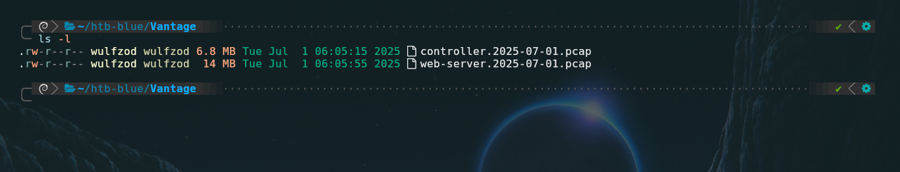

&ensp;

----

&ensp;

## Task 1: What tool did the attacker use to fuzz the web server ? (Format- include version e.g, nmap@7.80)

Para identificar la herramienta con la que el atacante hizo `fuzzing` al servidor web, debemos de filtrar el archivo `web-server.2025-07-01.pcap` por  el término `http.request`, el tráfico resultante indica una gran cantidad de peticiones realizadas en mili segundos y todas al mismo host, lo que evidencia el uso de una herramienta de automatización del tipo web fuzzer tales como gobuster, Wfuzz, FFuF o similar.
En los detalles de la capa de aplicación (Hypertext Transfer Protocol), en el valor `User-Agent` aparece la respuesta a la pregunta.

El formato de la respuesta debe ser `nombre@version`

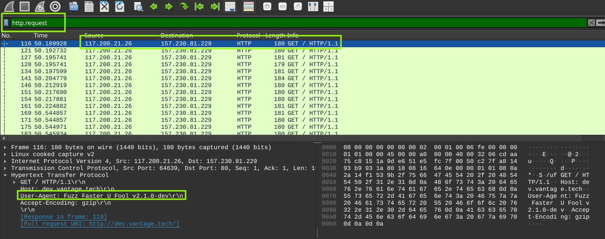
&ensp;


## `Respuesta:` ffuf@2.1.0 


&ensp;

---

&ensp;

## Task 2: Which subdomain did the attacker discover?

En la tarea 2 nos piden dar con el subdominio que el atacante logro descubrir mediante fuzzing.
Para no tener que inspeccionar más de 3000 paquetes uno por uno, podemos ir a **Statistics → HTTP → Requests**, se nos abrirá una ventana en la cual debemos filtrar por "Count", podremos ver el subdominio con más peticiones (42 peticiones) el cual es `cloud.vantage.tech`, este dominio respondió con un `200 OK` o un redirect, al atacante le pareció interesante y siguió enviando más peticiones.

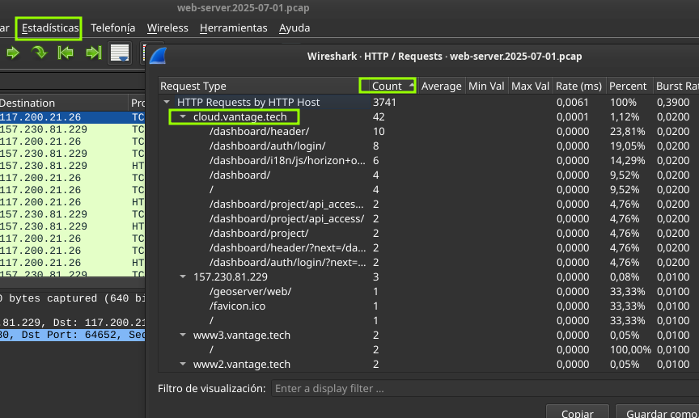

&ensp;

## `Respuesta:` cloud 

&ensp;

---

&ensp;

## Task 3: How many login attempts did the attacker make before successfully logging in to the dashboard?

¿Cuantos intentos de login realizo el atacante antes de poder logearse de forma exitosa en el dashboard?
Para contestar esta pregunta filtraremos por la dirección IP del atacante y el método http POST, nos encontramos con 4 paquetes, si los inspeccionamos cuidadosamente podremos ver en el campo `Refer` del primer paquete el parámetro `?next=/dashboard/` el cual hace referencia a una redirección y no un intento de login, probablemente es el navegador cargando la página de login por primera vez.

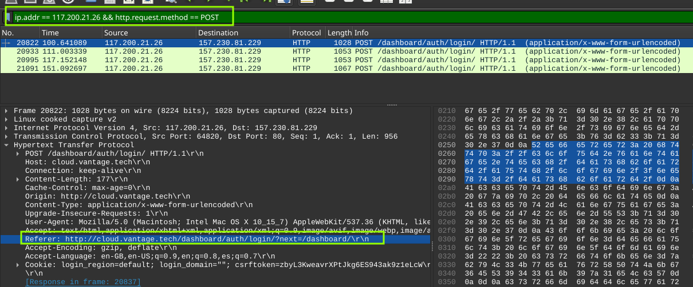

&ensp;

En los siguientes `tres` paquetes se puede ver el campo `Refer`  normal sin `?next=` además de varios intentos de login con diferentes credenciales siendo el último POST el exitoso, con el cual se logro acceder al dashboard usando las credenciales `username = admin` y `password = StrongAdminSecret`.

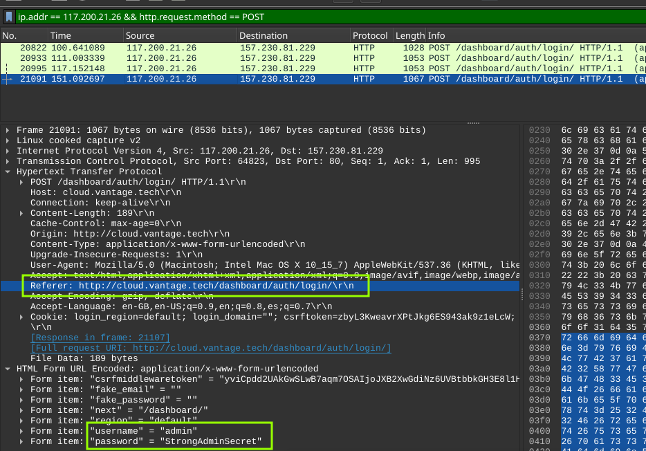

&ensp;

## `Respuesta:` 3

&ensp;

---

&ensp;

## Task 4: When did the attacker download the OpenStack API remote access config file? (UTC)

Para entender esto, primero debemos definir `OpenStack`: una plataforma de código abierto diseñada para gestionar nubes públicas y privadas. Al descargar el archivo de configuración de la API (`openrc`), el atacante obtuvo esencialmente 'las llaves del reino', lo que le permitió manipular toda la infraestructura a su antojo.

Podemos obervar la captura de la `Task 2`, en la cual se muestra el dominio `cloud.vantage.tech` como dominio encontrado por el atacante, unas líneas más abajo se puede ver un par de solicitudes a `/dashboard/project/api_acces/openrc/`  

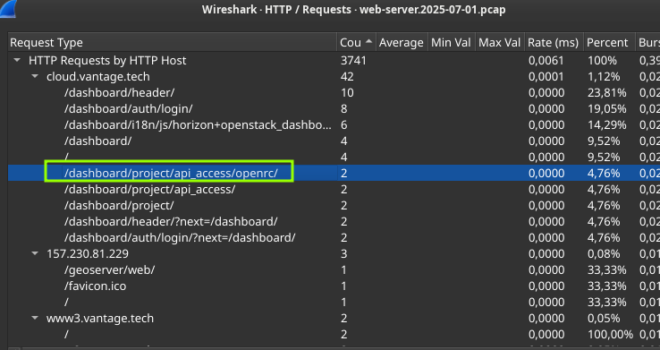

&ensp;

Para mejor visualización cambiaremos el formato de hora a UTC en la pestaña visualización de wireshark y si filtramos por solicitudes a `openrc`  daremos con la fecha y hora exacta del GET que descargo este archivo, además en uno de los paquetes se revela el nombre exacto de este archivo de configuración  llamado `admin-openrc.sh`, con el cual se podrá interactuar directamente con la API del controller.

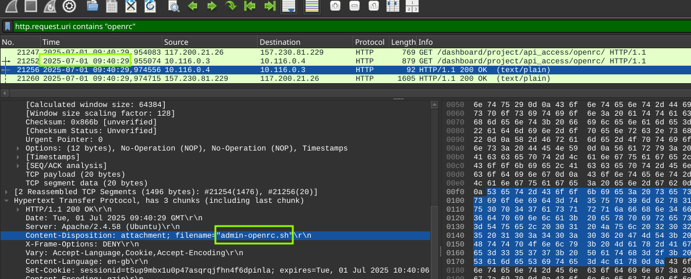

&ensp;

## `Respuesta:` 2025-07-01 09:40:29

&ensp;

---

&ensp;

## Task 5: When did the attacker first interact with the API on controller node? (UTC)

Es momento de inspeccionar la captura de red `controller.2025-07-01.pcap` , aplicando un filtro sencillo en el cual se especifica la IP del atacante y `http.request` podremos ver que el paquete n° 8490 es la primera interacción con el controller. En el campo `User-Agent` se aprecia el cliente de OpenStack siendo ejecutado.

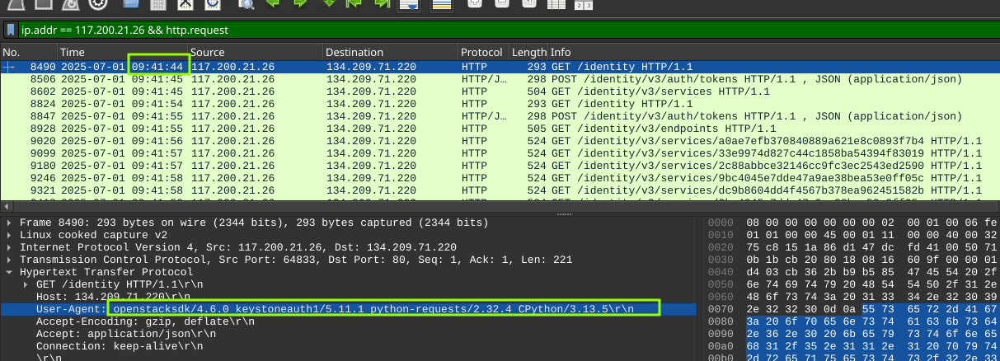

&ensp;

## `Respuesta:` 2025-07-01 09:41:44

&ensp;

---

&ensp;

## Task 6: Which OpenStack service provides authentication and authorization for the OpenStack API?

La respuesta a esta pregunta se puede deducir de la captura anterior en el mismo User-Agent esta la respuesta:

&ensp; 

```text
User-Agent: openstacksdk/4.6.0 keystoneauth/5.11.1 python-requests/2.32.4 CPython/3.13.5
```
&ensp;


`Keystone Auth` (o servicio de identidad de OpenStack) es un componente central que verifica la identidad de los usuarios, emite tokens de acceso y gestiona permisos para múltiples inquilinos, actuando como un guardian de la seguridad.

&ensp;

## `Respuesta:` keystone

&ensp;


---

&ensp;

## Task 8: What is the endpoint URL of the swift service?

Swift es el servicio de almacenamiento de objetos de OpenStack (el equivalente a Amazon S3 pero en versión privada). El atacante, después de autenticarse con Keystone, probablemente quiso listar o acceder a los contenedores/buckets para robar o filtrar datos.

El endpoint de Swift sigue un patrón típico:

&ensp;

```text
http://<ip_controller>:<puerto>/v1/<AUTH_project_id>
```

&ensp;

Swift por defecto usa el puerto 8080 (a diferencia de Keystone que usa el 5000 o 8774).

Filtrando por http y puerto de destino 8080 es posible encontrar la URL del servicio Swift.

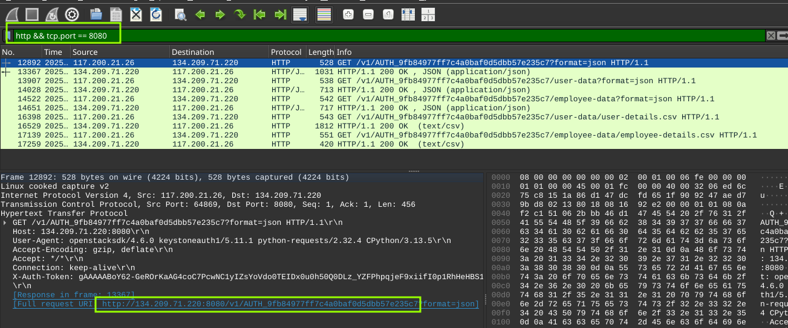

&ensp;

## `Respuesta:` 

## http://134.209.71.220:8080/v1/AUTH_9fb84977ff7c4a0baf0d5dbb57e235c7

&ensp;

---

&ensp;

## Task 9: How many containers were discovered by the attacker?

Para saber cuántos contenedores descubrió el atacante, se puede seguir el **HTTP Stream** del paquete `#12892` (el primer `GET` a Swift).
En los headers de la respuesta, el campo `X-Account-Container-Count` indica la cantidad de contenedores descubiertos:

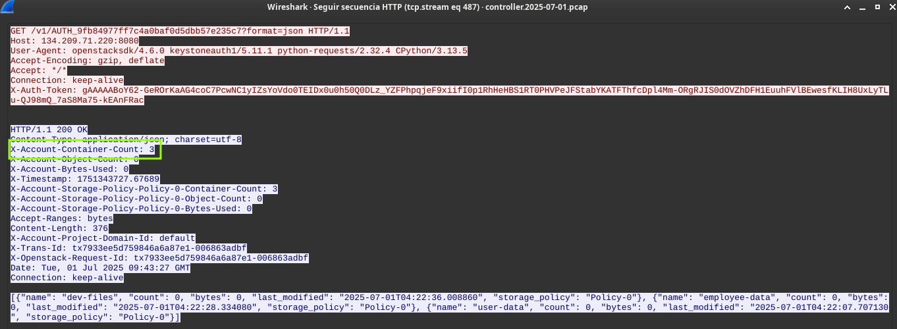

&ensp;

## `Respuesta:` 3

&ensp;

---

&ensp;

## Task 10: When did the attacker download the sensitive user data file? (UTC)


Una vez que el atacante listó los contenedores y exploró su contenido, fue directamente por lo que le interesaba: los datos de usuarios.
En el paquete `#16398` del pcap del controller, la petición habla por sí sola:

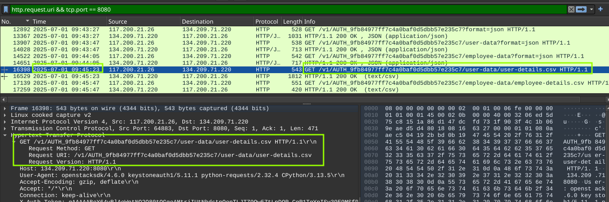

&ensp;

## `Respuesta:` 2025-07-01 09:45:23

&ensp;

---

&ensp; 

## Task 11: How many user records are in the sensitive user data file?

Para responder esta pregunta simplemente seguí el `http stream` del paquete `#16398` al filtrar por `http.request.uri && tcp.port == 8080`. Se puede ver la lista del registro de usuarios que descargo el atacante.

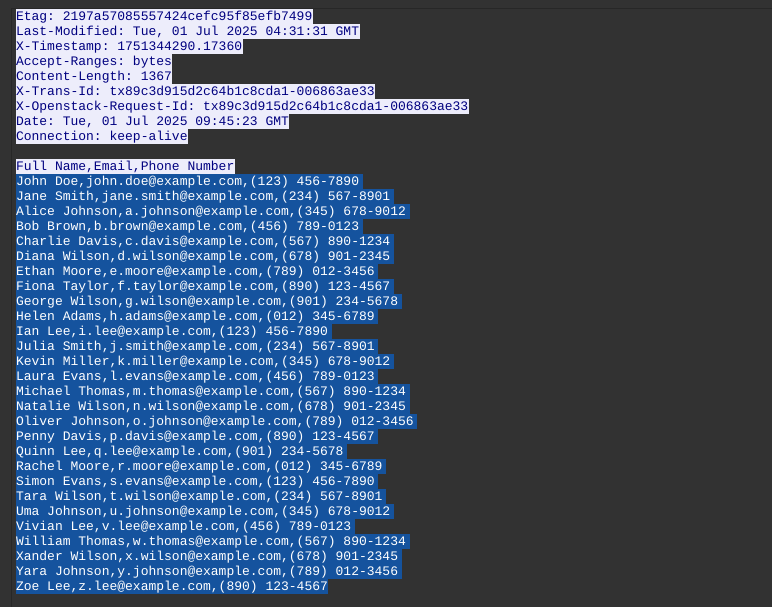

&ensp;


Para no contar una por una la cantidad de líneas simplemente copie y pegue el contenido del CSV (excluyendo el encabezado) en un archivo de texto para luego poder contabilizar con `wc -l` desde mi terminal.

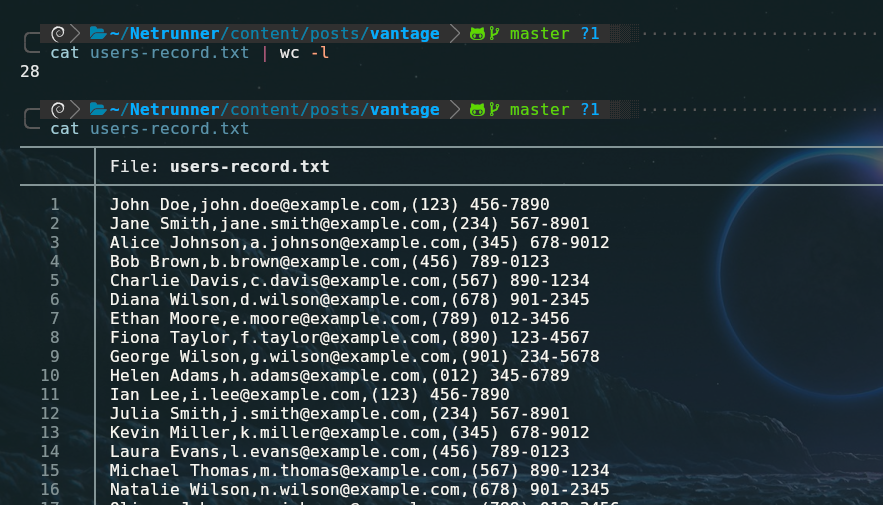

&ensp;

## `Respuesta:` 28

&ensp;

---

&ensp;

## Task 12: For persistence, the attacker created a new user with admin privileges. What is the username of the new user?

Para poder ganar persistencia a través de la creación de un nuevo usuario con privilegios de admin, el atacante debe de haber usado la CLI de OpenStack la cual se comunica con Keystone (encargado de la identidad).
El comando de creación de usuarios sigue una sintaxis como la siguiente:

```text
openstack user create --password <password> <nombre de usuario>
```

&ensp;

Filtrando por solicitudes POST a través del API de Keystone (`/v3/users`) damos con el nombre del nuevo usuario creado por el atacante.

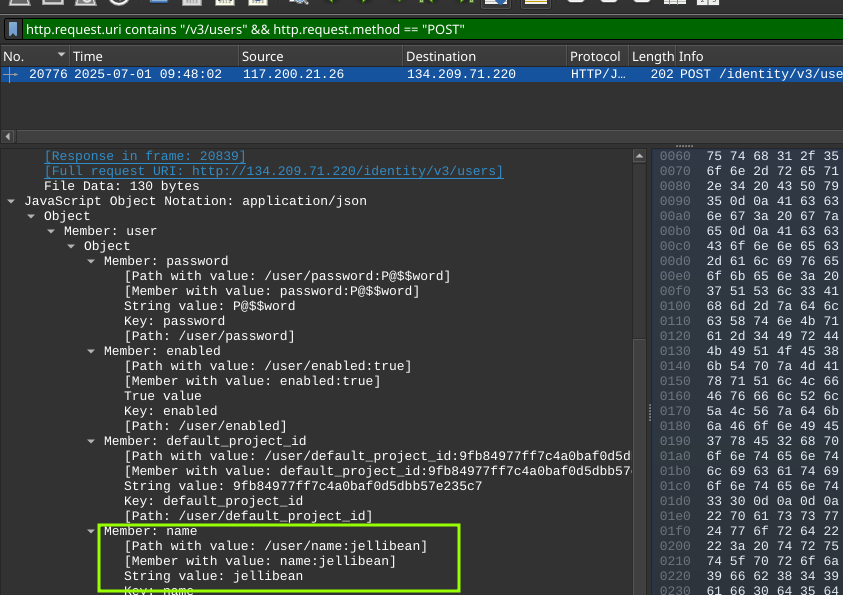

&ensp;

## `Respuesta:` jellibean

&ensp;

---

&ensp;

## Task 13: What is the password of the new user?

La respuesta a esta pregunta se puede ver en la captura anterior, en el mismo paquete que reveló la creación del usuario `jellibean` (n° 20776). Dentro del JSON de la petición esta la contraseña.

```json
"password": "P@$#word"
```
&ensp;

## `Respuesta:` P@$#word

&ensp;

---

&ensp;

## Task 14: What is MITRE tactic id of the technique in task 12?

El atacante no solo robó datos, preparó el terreno para volver. Siguiendo el marco MITRE ATT&CK, esta acción se clasifica como `T1136.003 (Create Account: Cloud Account)`.
La creación del usuario `jellibean` vía API (`POST /v3/users`) es una técnica clásica de persistencia (TA003) Al crear este nuevo usuario con contraseña propia (`P@$#word`), el atacante se asegura un método de autenticación alternativo que no depende de herramientas de acceso remoto tradicionales, permitiéndole operar a largo plazo sin ser detectado.

|Categoría|Identificador|Nombre|
|---|---|---|
|**Táctica**|`TA0003`|Persistence|
|**Técnica**|`T1136.003`|Create Account: Cloud Account|

&ensp;

## `Respuesta:` T1136.003

&ensp;

---

&ensp;

## `Resumen` 

**El atacante:**

* Entró por el servidor web (fuzzing + credenciales débiles/reutilizadas)
* Escaló al controlador de la nube privada usando credenciales de API descargadas del dashboard
* Robó un archivo CSV con 28 registros de usuarios 
* Dejó una puerta trasera: usuario `jellibean` con contraseña `P@$#word` y privilegios de admin

**Para evitarlo:**

1. WAF + Rate Limiting contra fuzzing
2. MFA obligatorio para cuentas administrativas
3. TLS en todos los endpoints de la nube privada
4. Auditoría de creación de usuarios y asignación de roles
5. Cifrado de datos sensibles en reposo

&ensp;

---

&ensp;

## `Conclusión`

En este lab aprendí que un punto de entrada aparentemente pequeño puede abrir las puertas a toda una infraestructura en la nube.

El atacante no necesitó exploits zero day ni herramientas sofisticadas. Con un fuzzing básico (`ffuf`), un subdominio mal protegido (`cloud.vantage.tech`), una contraseña administrativa débil o reutilizada (`StrongAdminSecret`), y una nube privada sin cifrado ni auditoría, pudo:

- Moverse lateralmente del servidor web al controlador
    
- Exfiltrar datos sensibles de usuarios
    
- Dejar una puerta trasera (`jellibean`) para seguir accediendo
    

**`La lección:`** La seguridad en la nube no es solo tecnología, es **configuración, monitoreo y buenas prácticas**. Un WAF, rate limiting, MFA y cifrado habrían parado este ataque en sus primeras fases.

&ensp;


